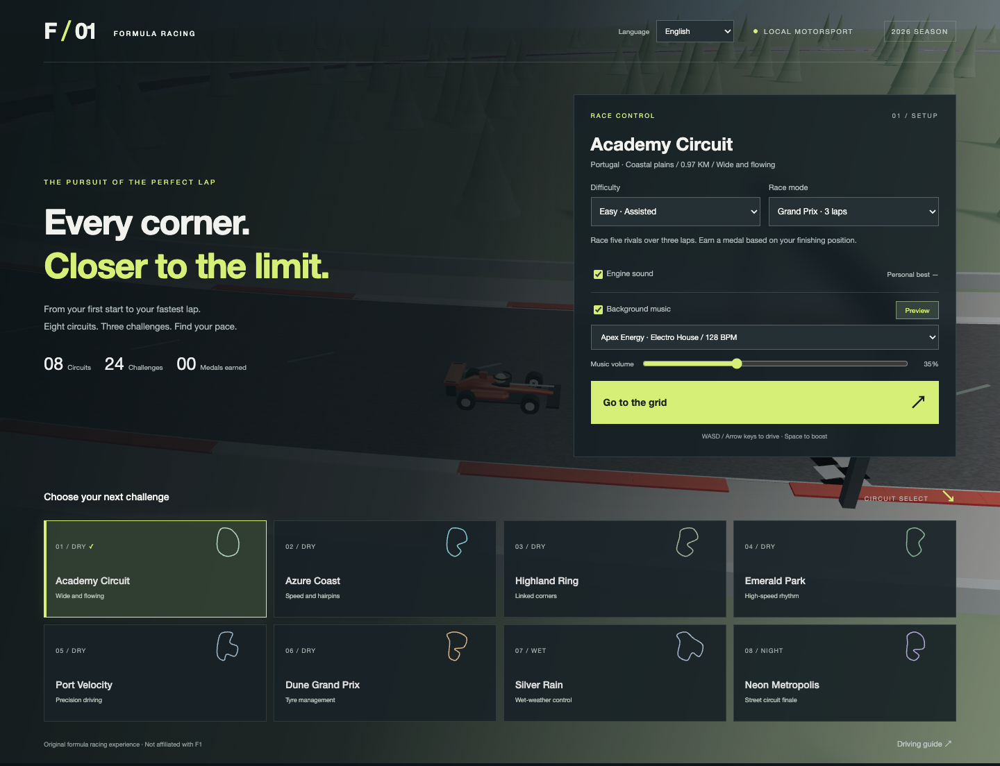

<!-- Generated from paired bilingual sources; update both languages together. Source: docs/source/README.json -->

# FORMULA / 01

[繁體中文](README.md)

<!-- section: section-00 -->

The **Language** menu switches between English and Traditional Chinese. Your preference persists without changing existing lap records, medals or ghost laps.

A locally playable 3D formula racing game with Chinese and English interfaces, original circuits and cars, rendered with Three.js.



<!-- section: section-01 -->

## Getting started

Requires Node.js 22+ and a modern WebGL-capable browser. On Mac, double-click **Start-Game.command**, or run these commands in the project directory:

```sh
npm ci
npm run dev
```

Open the local URL printed by the terminal (default http://127.0.0.1:5173). Game assets are bundled with the project; playing requires no CDN, account or external asset service. The initial dependency installation requires internet access.

<!-- section: section-02 -->

## Implemented features

- 8 original circuits with distinct routes and environments, including dry, wet, sunset and night conditions.
- Easy, Advanced and Pro difficulty: different driving assistance, AI target speeds and collision damage multipliers.
- Grand Prix: race 5 AI opponents over 3 laps, with a start countdown, live standings and finishing medals.
- Time trial: 2 laps with best valid lap times, personal records and a personal best ghost.
- Skill challenge: 1 lap inside the track limits, without resetting and with less than 5% damage.
- Each circuit offers 3 challenges, giving 24 combinations; records are further separated by difficulty.
- Fixed 120 Hz physics steps, grip limits, steering inertia, braking, wet-road differences, speed-dependent aero effects, tyre wear, energy boost and collisions.
- Three cameras, synthesized engine sound, minimap, live car status and lap timing.
- Pit-box tyre changes and repairs, reset stops, pause, restart and local saves.
- Keyboard, on-screen touch buttons and standard Gamepad API input.

<!-- section: section-03 -->

## Controls

| Action | Key |
| --- | --- |
| Throttle / brake | W / S or ↑ / ↓ |
| Steer left / right | A / D or ← / → |
| Energy boost | Space |
| Switch chase, cockpit and roof cameras | C |
| Pause / resume | Esc |
| Reset car, stop for 5 seconds and invalidate the current lap | R |
| Toggle background music | M |
| Pit service | Stop in the green box on the right after the start line, then press P |

Standard gamepad: left stick to steer, RT throttle, LT brake and A energy boost. The browser must report a standard mapping; physical gamepads have not been tested.

Records are stored in this browser's localStorage. Different browsers and URL origins have separate saves; clearing browser data removes them. Ghost cars do not collide with other cars.

<!-- section: section-04 -->

## Validation and builds

```sh
npm test
npm run build
npm run preview
```

After starting the development server in another terminal, run `npm run test:browser`. Tests default to Google Chrome on macOS; use `CHROME_PATH` to point to a Chrome executable on other platforms.

```sh
npm run dev -- --port 5173 --strictPort
# In another terminal
npm run test:browser
npm run test:english
npm run test:steering
npm run test:music
npm run docs:check
```

Browser validation includes actual keyboard input and complete race flows. The accelerated race verification interface is available only in development builds, never in production builds.

<!-- section: section-05 -->

## Release scope

This is the **v0.1 playable first release**. It uses procedural 3D models and simplified planar vehicle physics, not an engineering-grade F1 simulator. Visuals, suspension and full dynamic weight transfer need further development; gears are automatically displayed and mapped to sound, without a manual transmission model. Tyre temperature is calculated internally but does not yet affect grip.

Full career/championship modes, qualifying, formal pit lanes and AI pit strategy, complete flag penalties, dynamic weather, official brand licensing, high-fidelity art and steering-wheel force feedback are not implemented. All 8 circuits are directly selectable; the 24 challenges are circuit/mode combinations, not 24 independently scripted scenarios.

See the [design specification](docs/GAME_DESIGN.en.md), [development status](docs/ROADMAP.en.md) and [validation record](docs/VALIDATION.en.md) for details.

<!-- section: section-06 -->

## Six background music styles

Choose a track, preview it and adjust its independent volume in the Background music section. Track, volume and enabled state persist. During a race, click Music M or press M to toggle playback. Music and engine sound have separate controls.

| Track | Style | BPM |
| --- | --- | --- |
| Apex Energy | Electro House | 128 |
| Neon Drive | Synthwave | 110 |
| Redline Rush | Drum & Bass | 174 |
| Tunnel Pulse | Techno | 138 |
| Horizon Sprint | Trance | 140 |
| Grid Breaks | Breakbeat | 132 |

All six tracks are arranged live by the project's Web Audio synthesizer, including drums, bass, melodies and section variations. No third-party songs, samples or streaming services are required. Initial playback requires Preview or starting a race; reloading does not autoplay. Pausing, finishing or window blur stops the music; resuming the race restores it.

Run `npm run test:music` to verify all six audio renders, playback lifecycle and preference persistence.

<!-- section: section-07 -->

## Documentation and version parity

Chinese and English use the same game code and save format. Every change to features, controls, limitations or validation results must update both interfaces and documentation in the same commit.

Paired documents cover the README, design specification, development status, validation record and contribution guide. Read the [maintenance rules](CONTRIBUTING.en.md); edit `zh` and `en` for the same section in `docs/source/*.json`, run `npm run docs:generate` to produce Markdown, then run `npm run docs:check`.

GitHub CI checks bilingual fields, sections, list and table structure, command blocks, numeric values and generated-file synchronization. Automation cannot prove semantic equivalence; each item still requires human review.

<!-- section: selection-feedback -->

## Menu interaction feedback

Circuit cards provide hover lift, selection glow and click ripples. Changes to difficulty, mode, language and music also receive confirmation feedback. Keyboard selection uses the same feedback. With system reduced motion enabled, movement and ripples are disabled while static selection feedback remains.

GitHub images are refreshed through `npm run render:images`; `npm run render:check` verifies that screenshots match the current rendering inputs.
