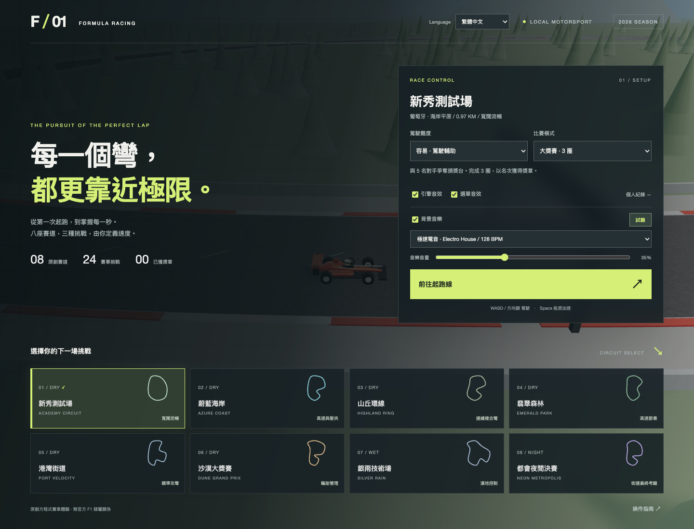

<!-- 此檔由雙語來源產生；請同時修改兩種語言。 Source: docs/source/README.json -->

# FORMULA / 01

[English](README.en.md)

<!-- section: section-00 -->

選單上方的 **Language** 可切換 English／繁體中文；語言偏好會保存，切換不影響既有圈速、獎章與幽靈車紀錄。

可在本機瀏覽器遊玩的 3D 方程式賽車遊戲。中英文介面，原創賽道與車輛，使用 Three.js 渲染。



<!-- section: section-01 -->

## 啟動

需要 Node.js 22+ 與支援 WebGL 的現代瀏覽器。Mac 可以雙擊 **Start-Game.command**，或在專案目錄執行：

```sh
npm ci
npm run dev
```

開啟終端顯示的本機網址（預設 http://127.0.0.1:5173）。遊戲資源隨專案打包，遊玩時不需要 CDN、帳號或外部素材服務。第一次安裝依賴需要網路。

<!-- section: section-02 -->

## 已實作

- 8 條不同路線與環境的原創賽道，包含乾地、濕地、黃昏與夜間。
- 容易、進階、專業難度：不同駕駛輔助、AI 目標速度與碰撞損傷倍率。
- 大獎賽：玩家與 5 名 AI 對手競賽 3 圈，起跑倒數、即時排名與完賽獎章。
- 計時挑戰：2 圈最佳有效圈速、個人紀錄及最佳圈幽靈車。
- 技巧挑戰：1 圈保持賽道內、不回正、車損低於 5%。
- 每條賽道有 3 種挑戰，共 24 個挑戰組合；紀錄再依難度分組。
- 固定 120 Hz 物理步長、抓地限制、轉向慣性、制動、濕地差異、空力速度效應、輪胎磨耗、能源加速與碰撞。
- 三種攝影機、引擎合成音效、小地圖、即時車況與圈速。
- 維修格換胎與修復、回正罰停、暫停、重新起跑及本機存檔。
- 鍵盤、螢幕觸控按鈕與標準 Gamepad API 輸入。

<!-- section: section-03 -->

## 操作

| 操作 | 按鍵 |
| --- | --- |
| 油門 / 煞車 | W / S 或 ↑ / ↓ |
| 左轉 / 右轉 | A / D 或 ← / → |
| 能源加速 | Space |
| 切換追車、座艙、車頂鏡頭 | C |
| 暫停 / 繼續 | Esc |
| 回正，原地罰停 5 秒並取消該圈有效性 | R |
| 背景音樂開關 | M |
| 維修 | 在起終點後右側綠色格停穩，按 P |

標準手把：左搖桿轉向、RT 油門、LT 煞車、A 能源加速。手把需瀏覽器正確回報標準 mapping；尚未使用實體手把驗證。

紀錄保存在目前瀏覽器的 localStorage。不同瀏覽器或不同來源網址的存檔獨立，清除瀏覽資料會移除紀錄。幽靈車不碰撞其他車輛。

<!-- section: section-04 -->

## 驗證與建置

```sh
npm test
npm run build
npm run preview
```

在另一個終端啟動開發伺服器後，可執行 `npm run test:browser`。測試預設使用 macOS 的 Google Chrome；其他平台可透過 `CHROME_PATH` 指向 Chrome 執行檔。

```sh
npm run dev -- --port 5173 --strictPort
# In another terminal
npm run test:browser
npm run test:english
npm run test:steering
npm run test:music
npm run docs:check
```

瀏覽器驗證包含實際按鍵操作及完整比賽流程。加速跑完整比賽的驗證入口只存在於開發建置，正式版本不提供。

<!-- section: section-05 -->

## 版本範圍

這是 **v0.1 可玩首版**。目前採程序生成 3D 模型及簡化的平面車輛物理，尚不是工程級 F1 模擬器。視覺、懸吊與動態重量轉移的完整模擬仍需深化；檔位為自動顯示與音效映射，沒有手排傳動模型。胎溫目前只在內部計算，尚未影響抓地。

完整生涯／錦標賽、排位、正式進站車道與 AI 進站策略、完整旗號處罰、動態天候、官方品牌授權、高擬真美術與方向盤力回饋尚未實作。8 個賽道均可直接選擇；24 個挑戰是賽道與模式組合，並非 24 套獨立腳本。

詳細資料見 [設計規格](docs/GAME_DESIGN.md)、[開發狀態](docs/ROADMAP.md) 與 [驗證紀錄](docs/VALIDATION.md)。

<!-- section: section-06 -->

## 六種背景音樂

在選單的「背景音樂」區塊選曲、試聽並調整獨立音量；曲目、音量與開關會保存。比賽中可點擊「音樂 M」或按 M 切換開關。音樂與引擎音效各自控制。

| 曲目 | 風格 | BPM |
| --- | --- | --- |
| 極速電音 / Apex Energy | Electro House | 128 |
| 霓虹疾馳 / Neon Drive | Synthwave | 110 |
| 紅線鼓打 / Redline Rush | Drum & Bass | 174 |
| 隧道脈衝 / Tunnel Pulse | Techno | 138 |
| 地平線衝刺 / Horizon Sprint | Trance | 140 |
| 起跑碎拍 / Grid Breaks | Breakbeat | 132 |

六首均由本專案的 Web Audio 合成器即時編曲，包含鼓組、低音、旋律與分段變化；不依賴第三方歌曲、取樣檔或串流服務。首次播放需點擊「試聽」或開始比賽；重新載入頁面不會自行播放。暫停、完賽與視窗失焦會停止音樂，繼續比賽時恢復。

執行 `npm run test:music` 可驗證六首音訊渲染、播放生命週期及偏好保存。

<!-- section: section-07 -->

## 文件與版本同步

中英文使用同一套遊戲程式與存檔格式。每次功能、操作、限制或驗證結果改動，都要在同一提交中更新兩種語言的介面與文件。

文件成對涵蓋 README、設計規格、開發狀態、驗證紀錄與貢獻指南。請閱讀 [維護規則](CONTRIBUTING.md)；編輯 `docs/source/*.json` 中同一章節的 `zh` 與 `en`，執行 `npm run docs:generate` 產生 Markdown，再執行 `npm run docs:check`。

GitHub CI 會檢查雙語欄位、章節、清單與表格結構、指令區塊、數值及輸出檔案同步。自動檢查無法證明翻譯語意完全相同，仍須人工逐項核對。

<!-- section: selection-feedback -->

## 選單操作回饋

賽道卡片提供滑過浮起、選取光暈與點選漣漪；難度、模式、語言與音樂選項切換也有確認提示。鍵盤選取使用相同回饋。系統開啟「減少動態效果」時，停用位移與漣漪，保留靜態選取提示。

GitHub 圖片由 `npm run render:images` 統一更新；`npm run render:check` 確認截圖對應目前的渲染輸入。

<!-- section: menu-audio -->

## 選單音效

選取按鈕、切換設定與開始比賽各有不同的短促原創合成音效，支援滑鼠、鍵盤與觸控。選單中的「選單音效」可獨立開關，偏好會保存，不受引擎音效或背景音樂開關影響。

首次播放需要使用者操作；不在滑過時自動播放。快速連續選取不會堆疊音量，切到背景或關閉音效會停止聲音。系統減少動態效果只影響動畫，音效仍由獨立開關控制。

使用 `npm run test:menu-audio` 驗證音訊渲染、操作觸發、靜音、偏好保存及音訊節點清理。
